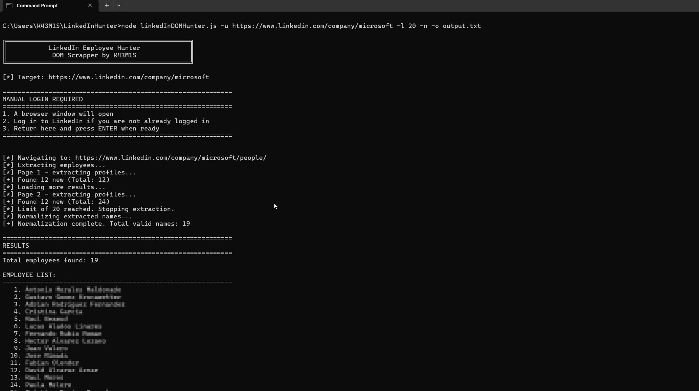

# LinkedIn Employee Hunter

**LinkedIn DOM Hunter** scrapes the `/people/` tab of any LinkedIn company page by interacting directly with the DOM via a stealth-patched Chromium instance. It supports pagination, result limiting, and an optional normalization pipeline that strips titles, suffixes, diacritics, and non-alphabetic characters — producing clean `Firstname Lastname` output ready for username generation or further enumeration.

## Requirements

- Node.js >= 18
- A valid LinkedIn session (manual login)

```bash
npm install
```

## Usage

```
node linkedinSpray.js -u <company_url> [-n] [-o <output_file>] [-l <limit>]
```

| Flag | Long form | Description |
|------|-----------|-------------|
| `-u` | `--url` | LinkedIn company page URL *(required)* |
| `-n` | `--normalize` | Apply name normalization pipeline |
| `-o` | `--output` | Output base filename |
| `-l` | `--limit` | Max number of profiles to extract |
| `-h` | `--help` | Show help message |


## Examples

```bash
# Basic extraction
node linkedinSpray.js -u "https://www.linkedin.com/company/microsoft/"

# Limit to 50 results with normalization, save to file
node linkedinSpray.js -u "https://www.linkedin.com/company/microsoft/" -n -l 50 -o results_microsoft
```




## Notes

- The script opens a real Chromium window and waits for manual login before proceeding. This avoids automated login detection.
- Tested against large company pages (Microsoft, etc.). Navigation uses `domcontentloaded` with a 60s timeout to handle heavy pages.
- The `/people/` tab requires a LinkedIn account with visibility into the target company's employee list.


## Disclaimer

This tool is intended for authorized penetration testing and OSINT engagements only. The author is not responsible for misuse. Always obtain proper written authorization before performing reconnaissance on any target.
